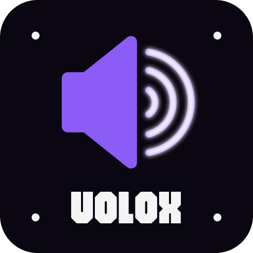

<p align="center">
  
</p>

<h1 align="center">Volox</h1>

<p align="center">
  <strong>Volume, the way it should be.</strong><br/>
  A lightweight desktop tray app for effortless volume control.
</p>

<p align="center">
  <a href="https://poorants.github.io/volox/">Homepage</a>
</p>

<p align="center">
  
  
  
</p>

---

## What is Volox?

Control your system volume with a simple mouse wheel or keyboard shortcut.
Global shortcuts that work **on top of any app**, paired with a clean OSD overlay.

## Key Features

| | Feature | Description |
|---|---------|-------------|
| **Alt + Wheel** | Volume Control | Instantly adjust volume with Alt + mouse wheel from anywhere |
| **Alt + Middle Click** | Mute Toggle | One click to toggle mute |
| **OSD** | On-Screen Display | Glassmorphism-styled volume status overlay |
| **Acceleration** | Step Acceleration | Volume step increases automatically on continuous input (up to 10%) |
| **Themes** | 3 Themes | Dark · Light · Cyber Pulse |
| **Customizable** | Shortcut Settings | Configure trigger keys, volume step, auto-start, and more |
| **Tray App** | System Tray | Sits quietly in the taskbar, activates only when needed |

## Default Shortcuts

| Action | Windows | macOS |
|--------|---------|-------|
| Volume Up | `Alt` + `Wheel Up` | `Alt` + `Arrow Up` |
| Volume Down | `Alt` + `Wheel Down` | `Alt` + `Arrow Down` |
| Mute Toggle | `Alt` + `Middle Click` | `Alt` + `M` |

> All shortcuts are customizable in Settings.

## Themes

| Dark | Light | Cyber Pulse |
|------|-------|-------------|
| Electric Violet on deep black | Clean white with violet accents | Cyan neon with slim pill OSD |

Switch themes via Tray Menu > Theme.

## Development

```bash
npm install
npm run dev

# Build
npm run build        # Current platform
npm run build:win    # Windows
npm run build:mac    # macOS
```

## Tech Stack

[Electron](https://www.electronjs.org/) · [koffi](https://koffi.dev/) · [loudness](https://github.com/nicehash/loudness) · [electron-store](https://github.com/sindresorhus/electron-store) · [Firebase Auth](https://firebase.google.com/docs/auth)

## License

ISC
